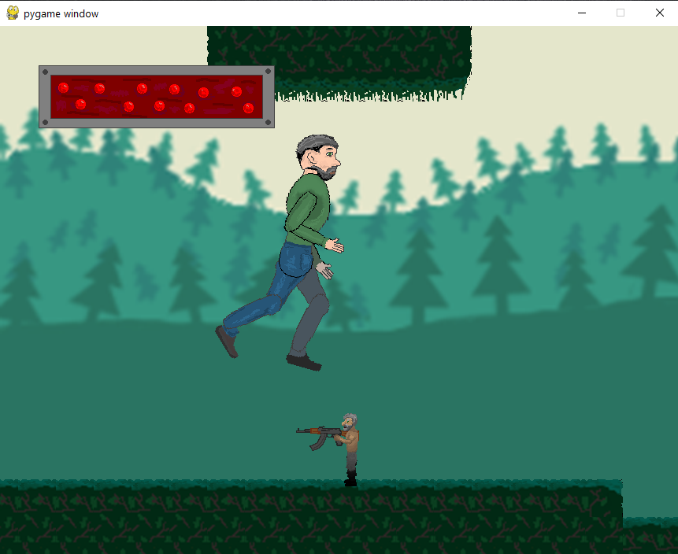

# Ioann's Platformer Game
Игра, написанная в школьные годы на python 2.7, с использованием только IDLE в качестве редактора кода.

Переведено на python 3. Проверено на python 3.12.

```bash
pip install pygame
python The_Game.py
```
